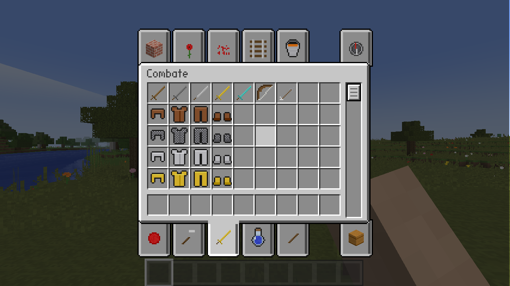

# MC-WEB

**Minecraft 1.8 reimplementado desde cero en C++20**, open source (MIT). Se compila de forma
nativa para **Linux y Windows** y el mismo código funciona en el **navegador** (WebAssembly + WebGL2).


*Captura con el pack libre (CC0) que trae el juego. Con tu `1.8.8.jar` se ven las texturas originales.*


*Inventario de supervivencia: cuatro tablones en la rejilla de 2x2 dan una mesa de trabajo.*

## Qué es (y qué no es)

MC-WEB es una **reimplementación en sala limpia**: el juego, el motor y el servidor están
escritos desde cero usando Minecraft 1.8 como *especificación*. Se basa en el comportamiento
observable del juego, en la documentación pública de [minecraft.wiki](https://minecraft.wiki)
y en los formatos de datos públicos (modelos JSON, NBT, Anvil y el protocolo de red 1.8).

- **No contiene código de Mojang.** No se usa código descompilado ni mappings, y nada de
  Eaglercraft.
- **No contiene assets de Mojang.** Las texturas, la fuente y los sonidos se cargan en tiempo de
  ejecución desde **tu propio** `1.8.8.jar`. Si no lo tienes, el juego usa un pack libre (CC0)
  generado por código.

Las reglas completas están en [CONTRIBUTING.md](CONTRIBUTING.md).

## Estado

| Fase | Contenido | Estado |
|---|---|---|
| F0 | CMake, SDL3 + OpenGL 3.3 / WebGL2, Linux + Windows + web, tests, CI | ✅ |
| F1 | Ver el mundo: packs, modelos JSON, texture array, mallado en hilos, AO y luz suave, cielo, nubes, niebla, generador de terreno propio | ✅ |
| F2 | Jugar: físicas, romper/colocar, día/noche ✅ · servidor integrado con protocolo 1.8, fluidos que corren | 🟡 |
| F3 | Supervivencia: vida, hambre, inventario, crafteo, horno, 8 criaturas, sonido, partículas ✅ · más criaturas, cría, armaduras | 🟡 |
| F4 | Guardado en formato Anvil (compatible con mundos 1.8) | ⏳ |
| F5 | Multijugador: servidores 1.8 reales y servidor dedicado propio | ⏳ |
| F6 | Redstone, Nether/End, opciones, empaquetado | ⏳ |

Lo que ya funciona:
- **Carga de assets de Minecraft**:
  - En nativo busca solo `.minecraft/versions/1.8.x`; en web eliges el jar y se guarda en IndexedDB.
  - Lee blockstates y modelos JSON con herencia, rotaciones, `uvlock` y variantes con peso.
  - Mete todas las texturas en un texture array con mipmaps y aplica las animaciones de los
    `.mcmeta` (agua, lava…).
  - Tiñe hierba y hojas con los colormaps de bioma.
- **Mundo infinito** con generador propio basado en ruido Perlin:
  - Biomas: océanos, playas, ríos, llanuras, bosques, abedules, taiga, taiga nevada,
    tundra, desierto, sabana, pantanos y montañas.
  - Cuevas y cavernas con lava en el fondo, y vetas de menas.
  - Árboles, flores, hierba, cactus, caña de azúcar y nenúfares.
- **Luz de cielo y de bloque** con propagación entre chunks y actualizaciones incrementales.
- **Render**:
  - Mallado en varios hilos, con luz suave y oclusión ambiental por vértice.
  - Pasadas sólido, cutout y translúcido; agua con alturas por esquina.
  - Cielo con sol, luna con fases, estrellas y amanecer; nubes y niebla.
- **Modos supervivencia y creativo**:
  - Físicas del jugador con las constantes de 1.8: andar a 4,317 bloques/s, correr, saltar
    1,25 bloques, agacharse sin caerse por los bordes, nadar, escalones de 0,6 y daño por caída.
  - En creativo: volar (dos veces espacio), romper al instante y todos los bloques en el inventario.
  - Cambio de modo en el menú de pausa (Esc).
- **Romper y colocar** con los tiempos de 1.8 (dureza, herramienta, bajo el agua, en el aire),
  grietas, contorno del bloque apuntado, drops (semillas, pedernal, manzanas, brotes…) y objetos
  que caen, giran y se recogen.
- **Colocación como en 1.8**: troncos según la cara, antorchas en paredes, hornos mirando al
  jugador, plantas de dos bloques; las flores y antorchas sin soporte caen y la arena y la grava
  caen al quitar lo de debajo.
- **Inventario completo**: barra rápida, inventario con rejilla de 2x2, mesa de trabajo (3x3,
  recetas con forma y sin forma de 1.8), horno con combustible y progreso. Clic, clic derecho
  (partir montón), mayús+clic (mover rápido) y tirar objetos (Q).

*Inventario creativo: la pestaña de Combate, con una fila por armadura (con el pack libre).*

- **Inventario creativo con pestañas** (como en 1.8): Bloques de construcción, Decoración, Redstone,
  Transporte, Varios, Alimentos, Herramientas, Combate, Pociones y Materiales, más el inventario de
  supervivencia (armadura, jugador, inventario y papelera) y la **búsqueda**. Cada grupo empieza en
  una fila nueva (una fila por tipo de herramienta, una por armadura, una por tinte...) y los libros
  encantados van a Combate o Herramientas según lo que encantan. Se desplaza con la rueda, arrastrando
  la barra o, en el móvil, con el dedo (con inercia). La búsqueda encuentra por nombre en español o en
  inglés, sin mayúsculas ni tildes y con varias palabras ("pico diam", "filo", "golden apple"); mientras
  se escribe, la tecla E no cierra el inventario. Recuerda la última pestaña que usaste.
- **Vida, hambre, saturación y aire**, regeneración, comer (mantener clic derecho), durabilidad de
  herramientas, pantalla de muerte y reaparecer (se sueltan los objetos).
- **Experiencia**: orbes que se mueven hacia ti y suben el nivel (barra y número encima de la
  barra rápida; 2n+7, 5n-38 y 9n-158 puntos por nivel). Dan experiencia los monstruos (5), los
  animales (1 a 3, las crías no), los minerales (carbón, lapislázuli, redstone, diamante,
  esmeralda y cuarzo), sacar cosas del horno y criar animales; al morir sueltas 7 puntos por
  nivel (hasta 100). `/xp <puntos>` y `/xp <niveles>L`. Se ve y se recoge también en multijugador.
- **Mesa de encantamientos**: hasta 15 estanterías a su alrededor (a dos bloques, con el hueco libre)
  dan las tres opciones de la ventana, que piden 1, 2 y 3 lapislázuli y niveles; el coste sale de las
  estanterías y de una semilla propia de cada jugador, como en 1.8, y cada opción da una pista del
  encantamiento (*Filo . . . ?*) escrita en runas. Vale para herramientas, armas, armadura y libros
  (el libro encantado guarda un solo encantamiento). Sobre la mesa flota un libro que se abre y mira
  hacia ti al acercarte (a menos de 3 bloques) y pasa páginas. Funciona también en multijugador.
- **Efectos de los 25 encantamientos de 1.8**: Protección (con los puntos de 1.8, tope de 25 y recorte a
  20), contra el fuego, explosiones y proyectiles, Caída de pluma, Espinas, Respiración, Afinidad y
  Agilidad acuáticas; Filo, Pesadez, Perdición de los artrópodos, Retroceso, Aspecto ígneo y Botín;
  Eficiencia, Toque de seda, Fortuna e Irrompibilidad; Poder, Golpe, Llama e Infinidad. Lo encantado
  brilla con un destello morado (iconos, objetos en el suelo y en la mano). La lava y el fuego queman
  al jugador (el agua apaga).
- **Yunque** (reparar y nombrar): repara con material (un cuarto de la durabilidad por unidad), junta dos
  objetos iguales, pasa los encantamientos de un libro (con sus incompatibilidades y su precio por
  rareza) y cambia el nombre; cada uso duplica la "penitencia" del objeto y a partir de 40 niveles
  sale "Demasiado caro". Se desgasta (12 % por uso) y acaba rompiéndose. Funciona en multijugador
  (también con clientes de 1.8: mineflayer renombra espadas en las pruebas de interoperabilidad).
- **Vagonetas y raíles**: raíl normal (rectas, curvas y cuestas, se une solo a los de al lado), propulsor (la
  potencia pasa a 8 raíles más en fila), detector (da señal mientras haya una vagoneta encima) y activador
  (baja al jinete y enciende la dinamita). Vagoneta normal (se monta, la empuja quien va dentro y agacharse
  la deja), con cofre, con horno (carbón: se empuja sola, 4 bloques por segundo) y con dinamita (explota a
  los 4 s en un raíl activador, con mechero o al chocar rápido). Cinco golpes con el puño (uno con espada)
  la rompen; a 1000 bloques de donde te subiste, el logro "Sobre raíles". Se guardan en el mundo y funcionan
  en multijugador, también con clientes de 1.8 (Spawn Object 10, Attach Entity y Steer Vehicle).
- **Armadura** (cuero, malla, hierro, oro y diamante): cuatro casillas en el inventario, se pone con
  clic derecho o mayús+clic, quita un 4 % del daño por punto (barra sobre la vida) y se desgasta
  con cada golpe; se ve sobre el jugador (también en multijugador). Las caídas, el ahogo y el
  hambre la ignoran (los encantamientos de protección, no todos), y al morir se suelta.
- **Criaturas**: cerdo, vaca, oveja, gallina, zombi, esqueleto, creeper y araña.
  - IA: los animales pasean, huyen si les pegas y siguen a quien lleva su comida (zanahoria, trigo,
    semillas); las ovejas comen hierba y se esquilan; las gallinas ponen huevos. Los zombis
    persiguen, las arañas trepan y saltan, los esqueletos disparan flechas y el creeper se enciende
    y explota.
  - **Cría de animales**: trigo a vacas y ovejas, zanahorias a cerdos y semillas a gallinas los
    ponen en modo amor (corazones, 30 s); dos iguales cerca se buscan y, tras 60 ticks juntos,
    tienen una cría que mide la mitad, sigue a los adultos y crece en 20 min (la comida le quita
    el 10 % de lo que le falta). Los padres esperan 5 min. Criar vacas da el logro *Repoblación*.
    También se ven en multijugador (cría con la edad de 1.8 y corazones).
  - Aparecen como en 1.8: animales al generarse el mundo (con un 5 % de crías); monstruos de
    noche o en cuevas oscuras.
    Zombis y esqueletos arden al sol.
  - Combate con el daño de cada arma de 1.8, críticos, retroceso y botín (chuletas, cuero, lana,
    plumas, huesos, pólvora, hilo...).
  - **Arco y flechas**: mantén el clic derecho para tensarlo (1 s = a tope, con el zoom y el
    frenado de 1.8) y suelta para disparar; la potencia, el daño (y el crítico a plena potencia),
    la caída de la flecha y la dispersión son los de 1.8. Gasta una flecha y 1 de durabilidad
    (nada de eso en creativo), y las flechas clavadas se recogen. En táctil, mantén el dedo.
    Abatir a un esqueleto desde 50 bloques da el logro *Francotirador*.
  - Modelos propios hechos a partir de la disposición estándar de las texturas: con tu jar se ven
    con sus texturas originales; sin él, con las del pack libre.
- **Sonido sintetizado**: romper y pisar según el material, criaturas, explosiones, arco, comer...
  Se genera todo al arrancar (1.8 no trae los sonidos en el jar), con sonido posicional.
- **Partículas**: trozos de bloque al romper, polvo al correr, humo, chispas de crítico, llamas.
- **Ajustes** (Esc → Ajustes), con páginas y se guardan:
  - *Gráficos*: calidad (baja/media/alta/ultra), distancia hasta 32 chunks, resolución 3D,
    FPS máximos, VSync, campo de visión, brillo, luz suave, hojas detalladas o rápidas, nubes,
    niebla, mipmaps, partículas, distancia de las criaturas y balanceo al andar.
  - *Música y sonidos*: volumen general, música (piano generativo), bloques, criaturas,
    jugador, interfaz y subtítulos.
  - *Controles*: sensibilidad, invertir ratón, correr/agacharse manteniendo o alternando, salto
    automático, y en táctil: puntería (mira central o tocar para apuntar), sensibilidad, suavizado
    de la cámara, joystick fijo (el de serie: no se mueve nunca) o flotante (nace donde pones el pulgar y ahí se queda), con zona muerta y curva, botones de atacar y usar, modo
    zurdo, vibración, tamaño y opacidad de los botones. *Teclas*: todas se pueden cambiar.
  - *Partida*: modo, dificultad (pacífica, fácil, normal, difícil, como en 1.8), ciclo de día y
    noche, hora, aparición de criaturas y conservar el inventario.
  - *Interfaz*: escala, cámara en primera o tercera persona, mano, punto de mira, FPS,
    coordenadas y subtítulos.
- **Pantalla de depuración (F3)** con la fuente del juego.

## Rendimiento

- **Tantos FPS como dé la pantalla**: 60, 120, 144 Hz... El juego va por ticks (20 por segundo) e
  interpola, así que la animación es fluida a cualquier frecuencia.
- **Todos los núcleos, también en el navegador**: en web, la generación del mundo y el mallado van
  a varios Web Workers (sin necesidad de COOP/COEP); en nativo, a hilos.
- **Pocas llamadas a la GPU**: las mallas de todo el terreno viven en unos pocos buffers grandes y se
  dibujan con una llamada por buffer (multi-draw; en el navegador, con `WEBGL_multi_draw`), en vez de
  cientos de llamadas por frame. Cambiar un bloque solo vuelve a subir su sección.
- **Solo se dibuja lo que se ve**: además del recorte por la pirámide de visión, una oclusión por grafo de
  visibilidad deja fuera lo que tapa la roca (en una cueva, un 90 % menos de geometría), y el pase de
  bloques sólidos no descarta fragmentos (en las GPU de móvil evita pintar dos veces lo que otro tapa).
- **Rendimiento automático**: en Ajustes > Gráficos eliges los fps que quieres mantener (30 a 144) y el
  juego baja la resolución del mundo y la distancia de render cuando no llega, y las recupera cuando
  sobra (activado a 60 en el navegador; `--auto-fps N` en nativo).
- **Hilo principal ligero**: lo que llega de los workers se sube a la GPU con un presupuesto por frame
  (una cuarta parte del frame).
- **La GPU potente**: el `.exe` de Windows y la página web piden la tarjeta dedicada en portátiles con
  dos GPU (`NvOptimusEnablement`, `AmdPowerXpressRequestHighPerformance` y `powerPreference:
  'high-performance'`). En Linux, lanza el juego con `DRI_PRIME=1` (AMD e Intel) o con
  `__NV_PRIME_RENDER_OFFLOAD=1 __GLX_VENDOR_LIBRARY_NAME=nvidia` (NVIDIA).
- **Optimización entre archivos (LTO)** en las compilaciones Release del código propio (`-DMCWEB_LTO=OFF`
  la desactiva).
- **Medir**: F3 enseña los fps, la CPU por fase del frame (red, carga, tick, cielo, terreno, entidades...), el
  tiempo de GPU donde el sistema lo permita, las llamadas de dibujo y los quads. `--log-perf` lo escribe
  cada segundo; `--bench N [--bench-spin]` mide con la cámara dando vueltas y sale; `tools/bench/render-bench.sh`
  hace la tabla de dos escenas (superficie y cueva). `mcweb-bench` mide lo que cuesta generar y mallar.
  Los números y lo conseguido están en [`docs/rendimiento.md`](docs/rendimiento.md).

**iPhone con pantalla de 120 Hz (ProMotion)**: Safari limita las páginas a 60 Hz. Para jugar a
120 Hz, desactiva *Prefer Page Rendering Updates near 60fps* en Ajustes → Apps → Safari → Avanzado
→ Feature Flags. La página te dice a cuántos Hz va tu pantalla.

## Jugar

### Linux / Windows

Descarga el ejecutable de los artefactos de la [CI](../../actions) o compílalo (ver abajo).
Si tienes Minecraft instalado y has abierto la 1.8.8 al menos una vez, el juego encuentra el
jar solo. Si no, pásaselo:

```bash
./mcweb --jar /ruta/a/1.8.8.jar
```

### Navegador

```bash
python3 web/serve.py build/web/apps/mcweb     # abre http://localhost:8080
```

El servidor añade las cabeceras COOP/COEP que necesitan los hilos (SharedArrayBuffer).
Si la página se sirve sin esas cabeceras (GitHub Pages, cualquier hosting estático), carga sola
la variante sin hilos (`mcweb-st.js`): va igual, pero carga el mundo algo más despacio.
Al abrir la página eliges tu `1.8.8.jar` (o juegas con el pack libre).

### Móvil y tablet

En pantallas táctiles la página activa sola los controles táctiles, con una mira en el centro (al estilo
de la edición de bolsillo, pero con la mira central de los juegos de móvil modernos):
- **Joystick** (a la izquierda; aparece donde pongas el pulgar y su base sigue al dedo): moverse. A tope
  hacia delante, corres, y sigues corriendo aunque aflojes un poco; al volver al centro, paras. Zona
  muerta y curva ajustables.
- **▲** (abajo a la derecha): saltar. Dos toques seguidos en creativo: volar; manteniéndolo, subir.
- **▼**: agacharse (un toque lo deja puesto, mantenerlo agacha solo mientras se aprieta). Volando: bajar.
- **Espada**: golpear y romper (mantenida). **Bloque**: colocar, usar, comer o tensar el arco (mantenido).
- **Arrastrar** en el resto de la pantalla: mirar. El giro se aplica en cada frame, sin perder lo que
  recorre el dedo al empezar.
- **Tocar**: usar o colocar donde apunta la mira (abrir mesa de trabajo u horno); sobre una criatura,
  golpearla (con tijeras, esquilar ovejas).
- **Mantener** el dedo quieto: romper, **sin soltarlo se puede seguir girando**. Con comida en la mano:
  comer.
- **Barra rápida**: tocar o deslizar el dedo sobre ella elige casilla. El botón junto a la barra abre el
  inventario.
- **Arriba a la derecha**: soltar (un toque suelta uno, mantener suelta toda la pila), cámara (primera
  o tercera persona), chat y pausa.
- **Otros modos**: "tocar para apuntar" (el dedo apunta al bloque y no hay mira ni botones de atacar y
  usar), modo zurdo (todo se refleja), botones más grandes o más claros, y vibración en Android.
- **En los inventarios**: tocar = clic, mantener = clic derecho, arrastrar = desplazar la lista
  del creativo (sigue deslizándose al soltar; tocar la frena), tocar las pestañas o arrastrar su
  barra, **✕** para cerrar. En la pestaña de búsqueda, tocar el campo saca el teclado.
La página pide pantalla completa y apaisado, y mantiene la pantalla encendida mientras juegas.

Funcionan también en portátiles táctiles con Windows o Linux (y se fuerzan con `--touch`).
Para usar tus texturas en el móvil, copia el `1.8.8.jar` a iCloud Drive, Google Drive o la
carpeta de descargas y elígelo en la página.

### Controles

| Tecla | Acción |
|---|---|
| Clic | Capturar el ratón |
| WASD / ratón | Moverse / mirar |
| Espacio | Saltar (dos veces seguidas: volar en creativo) |
| Mayús | Agacharse (volando: bajar) |
| W dos veces / Ctrl | Correr |
| Clic izquierdo | Romper (mantener) · golpear criaturas |
| Clic derecho | Colocar, usar, comer, esquilar (tijeras) |
| Clic central | Coger el bloque apuntado (creativo) |
| 1–9 / rueda | Casilla de la barra rápida |
| E | Inventario (en creativo: pestañas; el campo de búsqueda escribe, Esc cierra) |
| Q / Ctrl+Q | Tirar un objeto / el montón |
| Esc | Menú de pausa y Ajustes (también en el navegador) |
| F5 | Cámara: primera persona, detrás, delante |
| F1 | Ocultar la interfaz |
| F3 | Pantalla de depuración |
| RePág / AvPág | Distancia de render |
| F2 | Captura de pantalla |
| F11 | Pantalla completa |

Opciones de línea de comandos: `mcweb --help` (por ejemplo `--mode creative`). En web se pasan
como parámetros de la URL, por ejemplo `index.html?seed=1234&rd=10&mode=creative`; la página
también tiene un selector de modo.

## Skins

En el menú principal, **Skins**: elige una de serie (Steve y Alex, que salen del paquete de
texturas activo) o sube tu PNG de 64x64 o 64x32. El personaje se ve girando y la skin queda
elegida al momento; **Capas...** enciende o apaga el sombrero, la chaqueta, las mangas y las
perneras, como la pantalla de personalizar skin de 1.8.

- Las skins de 64x32 (las antiguas) se convierten solas, y los **brazos finos** (el modelo Alex)
  se detectan al subirlas; se pueden cambiar con el botón *Brazos*.
- Tus skins se guardan en la carpeta `skins/` de los datos de usuario (en la web, en el
  navegador). También vale copiar ahí un PNG a mano.
- En multijugador, los jugadores de MC-WEB ven tu skin: se manda por un canal propio
  (`MCWEB|Skin`) que solo se usa con servidores de MC-WEB. Un servidor de Minecraft 1.8 normal no
  recibe nada de eso (y no tiene cómo pasar skins que no estén en los servidores de Mojang).
  Quien no manda skin se ve con Steve o Alex según su UUID, como en 1.8.

## Multijugador

MC-WEB habla el protocolo de Minecraft 1.8 (versión 47) en modo offline: se puede jugar con
otros MC-WEB y con el Minecraft 1.8 oficial.

- **Abrir en LAN** (menú de pausa, versión de escritorio): tu partida se convierte en servidor.
  Se anuncia en la red local, como en 1.8, y la pantalla te dice la dirección para compartir.
  Los invitados se guardan con el mundo (`playerdata/`).
- **Multijugador** (menú principal): servidores guardados con su ping, partidas de la LAN,
  conexión directa y tu nombre de jugador.
- **Servidor dedicado** (`mcweb-server`, sin ventana): lee `server.properties` (puerto, MOTD,
  modo, dificultad, semilla, tipo de mundo, distancia de visión, lista blanca). Tiene consola con
  `help`, `list`, `say`, `kick`, `time`, `whitelist`, `save-all` y `stop`.

  ```bash
  mcweb-server --dir mi-servidor          # crea mi-servidor/server.properties y el mundo
  ```
- **Desde el navegador**: la web no puede abrir conexiones TCP, así que usa el puente
  `mcweb-wsproxy`. Arráncalo en tu equipo y, en Multijugador, pon `ws://localhost:25500` como
  proxy (es el valor por defecto).

  ```bash
  mcweb-wsproxy                            # ws://127.0.0.1:25500, solo este equipo
  mcweb-wsproxy --listen 0.0.0.0:25500 --allow mi.servidor.org:25565   # para otros, limitado
  ```

Las cuentas premium (servidores con `online-mode=true`) aún no están soportadas: necesitan
iniciar sesión con Microsoft.

## Compilar

Necesitas CMake ≥ 3.25, Ninja y un compilador de C++20. Las dependencias se descargan solas y
quedan fijadas a una versión: SDL3, glm, miniz, nlohmann/json, stb y doctest.

```bash
# Linux (dependencias de sistema de SDL3: ver .github/workflows/ci.yml)
cmake --preset linux-release && cmake --build --preset linux-release
ctest --preset linux-release

# Windows (Visual Studio 2022)
cmake --preset windows-msvc && cmake --build --preset windows-msvc

# Windows desde Linux (MinGW-w64)
cmake --preset windows-mingw && cmake --build --preset windows-mingw

# Web (con emsdk activado: source emsdk/emsdk_env.sh)
cmake --preset web && cmake --build --preset web
```

Para validar las tablas contra tus assets reales, descomprime `assets/` de tu jar **fuera del
repo** y ejecuta los tests con `MCWEB_ASSETS_DIR=/esa/carpeta`.

## Arquitectura

```
src/core      buffers/VarInt, zip, hilos, rutas, log
src/data      bloques, ítems, recetas, herramientas, drops, formas de colisión, biomas y el mapa
              estado→blockstate de 1.8 (tablas de minecraft-data, MIT)
src/world     chunks, ruido, generador de terreno, motor de luz
src/assets    packs (jar/zip/carpeta/CC0), modelos JSON de bloques e ítems, texturas, pack libre generado
src/game      reglas del juego sin gráficos: jugador y físicas, criaturas e IA, combate, explosiones,
              inventario, menús, crafteo, horno, romper/colocar, drops (probado con tests)
src/save      NBT, regiones Anvil, level.dat, playerdata y estadísticas (formato de 1.8)
src/net       protocolo 1.8 (47): tramas, chunks, cliente, servidor, sockets, LAN, WebSocket
src/client    mallador, renderer (GL 3.3 / WebGL2), modelos de criaturas, partículas, sonido
              sintetizado, cielo, HUD e inventarios, menús, opciones, controles táctiles, Web Workers
apps/worker   módulo de los Web Workers del build web (genera y malla sin gráficos)
apps/bench    medidor de rendimiento de la carga del mundo
apps/mcweb    punto de entrada (SDL3 main callbacks)
apps/mcweb-server   servidor dedicado sin ventana
apps/mcweb-wsproxy  puente WebSocket <-> TCP para jugar en servidores desde la web
web/          página del build web y servidor local
```

## Licencia

[MIT](LICENSE). Minecraft es una marca de Mojang AB; este proyecto no está afiliado ni
respaldado por Mojang ni por Microsoft.
